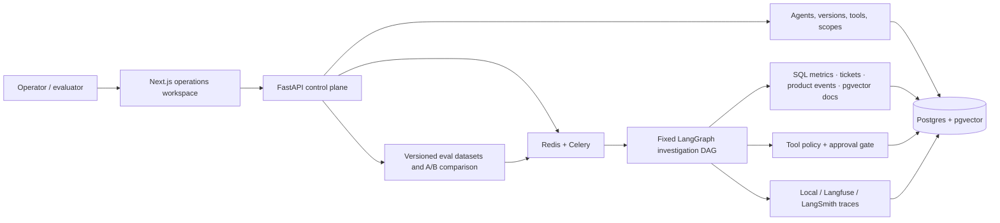
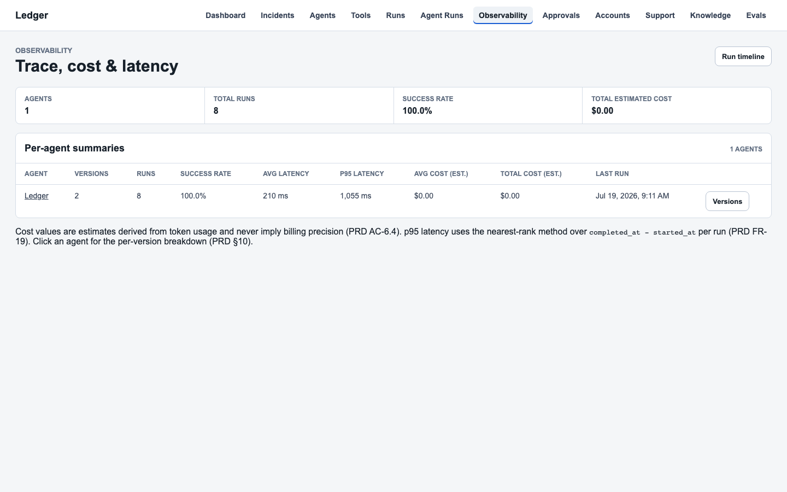
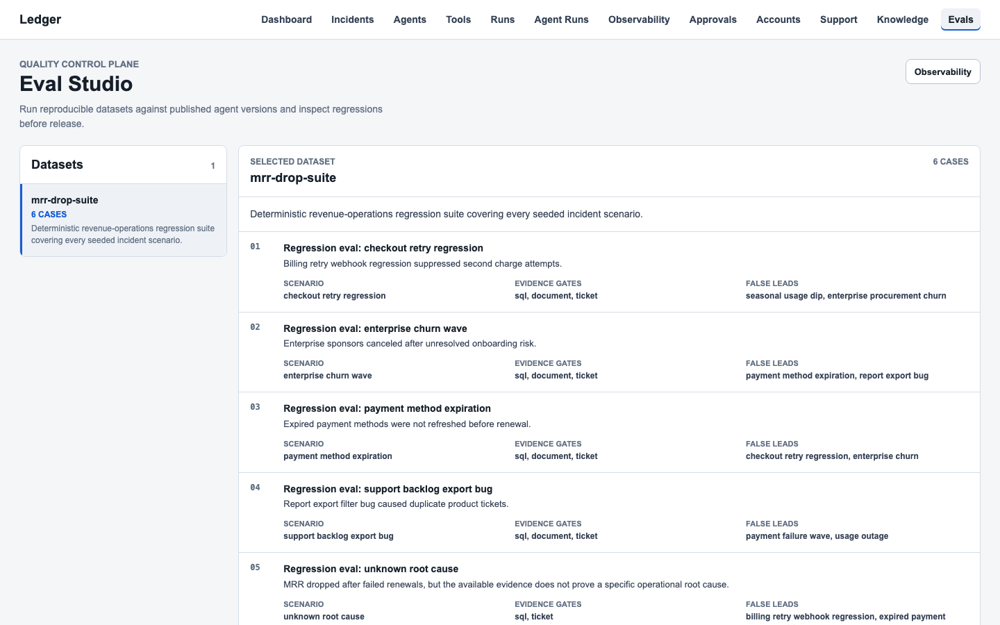

# Ledger

Ledger is a production-shaped SaaS revenue investigation agent and the control plane used to operate it. It acts like a forensic accountant for SaaS operations: every claim is backed by a cited source, every action leaves an audit trail, and every run is reconstructable. The name reflects both the financial record and the immutable evidence log at the heart of the product.

The repository tells two connected portfolio stories:

- **Project 1 - Ledger:** anomaly detection, evidence retrieval, cited reports, approval-gated mock actions, traces, and deterministic evals.
- **Project 2 - Agent Control Plane:** immutable agent versions, a governed tool registry, launchable runs, cost/latency observability, a global approval queue, and A-vs-B regression evaluation.

The product is intentionally not a toy chatbot. Every important claim is expected to link back to retrieved evidence, every tool call is permission-checked, and every risky action remains a mock until an operator decides it.

[Watch the recorded walkthrough](docs/assets/ledger-walkthrough.webm) or follow the [narrated demo script](docs/demo-script.md).

## The Problem

A fluent incident summary is easy to demo and hard to trust. Production teams need to know which evidence an agent retrieved, which version and tools it used, what failed, how much the run cost, whether a change regressed quality, and whether a proposed action crossed an approval boundary.

Ledger makes those questions inspectable from the UI and reconstructable from the database. Deterministic analytics and retrieval produce the evidence; the LLM layer, when enabled, synthesizes it through a structured schema. The same seeded cases then become regression tests for agent quality and safety.

## Architecture



The fixed investigation graph keeps execution auditable. Published agent versions snapshot their prompt, model, enabled tools, and allowed scopes. Every run persists its input, ordered steps, blocked calls, trace reference, model usage, final report, mock actions, approval decisions, and eval results.

Phase 6 introduces action and eval permissions as a new published `ledger_phase6` snapshot. Published versions are immutable through the runtime API; the only writes to published rows are explicit, reversible Alembic data backfills (`20260709_0012` for scopes, `20260719_0018` for the v1 action tool IDs) that keep the seeded baseline consistent with the uniform tool policy, so historical run/version references remain reproducible.

### What to inspect first

| Question | Surface |
| --- | --- |
| What changed in the business? | Revenue dashboard and incident evidence |
| Why should I trust the diagnosis? | Run report, citations, step timeline, and trace |
| What can this version do? | Agent version and tool registry |
| Can it act without approval? | Tool scopes, mock actions, and approval queue |
| Did a new version regress? | Eval Studio A-vs-B comparison |
| What does it cost and how long does it take? | Observability dashboard |

## Product Tour





The screenshots are generated from the seeded local stack with `npm run portfolio:assets`; no customer data is used.

## Five-Minute Demo

1. Open **Agents**, inspect the published Ledger, and review its immutable tool/scopes snapshot.
2. Open **Tools** to verify schemas, permission scopes, and implementation bindings are explicit.
3. Launch the published version against the seeded MRR-drop incident and inspect the ordered run timeline, citations, trace, token usage, and estimated cost.
4. Open **Approvals** and verify that the high-risk customer follow-up is pending until it is approved or rejected.
5. Open **Eval Studio**, compare the good version with the intentionally degraded version, and inspect the case that flips from pass to fail.
6. Open **Observability** to compare success rate, average/p95 latency, and estimated cost per version.

The exact narration, expected evidence, and recovery steps are in [docs/demo-script.md](docs/demo-script.md).

## Product Direction

The intended workflow:

1. Detect or select a revenue anomaly.
2. Investigate billing, account, product usage, support, and incident evidence.
3. Produce a concise root-cause report with citations.
4. Identify affected accounts and recommended actions.
5. Draft follow-ups as approval-gated mock actions.
6. Record run steps, traces, cost estimates, failure modes, and eval results.

The first version should prioritize evidence quality, eval correctness, and approval safety over a large integration surface.

## Readiness Model

Use these labels when deciding what kind of inspection the project is ready for:

- **Engineering inspection ready** - the stack boots locally, migrations run, seed/bootstrap is repeatable, tests pass, and the UI/API expose at least one coherent vertical slice.
- **Product slice review ready** - a reviewer can inspect an anomaly, supporting evidence, affected accounts, citations, and visible failure/safety boundaries in the UI.
- **MVP acceptance ready** - the app satisfies the success criteria in `prd.md`, including seeded evals, approval-gated mock actions, run traces, cost/token estimates, and evidence-backed final reports.

Do not advance a readiness label by editing this file. Advance it by adding implementation, tests, and inspection evidence.

## Structure

- `apps/api` - FastAPI, Pydantic, SQLAlchemy/Alembic, Postgres/pgvector, governed agent/tool/run domains, Celery workers, tracing, evals, and behavior tests.
- `apps/web` - Next.js App Router UI for incidents, agents, tools, runs, approvals, observability, knowledge, and versioned eval comparison.
- `docker-compose.yml` - Local Postgres (pgvector), Redis, API, Celery worker, and web services with health checks.
- `render.yaml` - Render Blueprint for the API, worker, Postgres, and Key Value services.
- `apps/web/vercel.json` - Vercel project configuration for the Next.js frontend.
- `docs` - deployment, security, demo, verification, and portfolio evidence.
- `prd.md` - Product brief and success criteria.
- `AGENTS.md` - Project guardrails for future agent work.

## Local Setup

Create local environment files:

```bash
cp .env.example .env
cp apps/api/.env.example apps/api/.env
cp apps/web/.env.example apps/web/.env.local
```

Start the stack:

```bash
docker compose up --build
```

`docker compose up` boots Postgres, Redis, the API, a Celery worker, and the web
frontend. The API container runs migrations and seeds the demo dataset on first
startup. Use `docker compose ps` to verify all services report healthy.

Useful URLs:

- Backend health: http://localhost:8000/health
- Backend readiness: http://localhost:8000/ready
- API docs: http://localhost:8000/docs
- Frontend: http://localhost:3000
- Agent registry: http://localhost:3000/agents
- Tool registry: http://localhost:3000/tools
- Control-plane runs: http://localhost:3000/runs
- Observability: http://localhost:3000/dashboard
- Incidents: http://localhost:3000/incidents
- Accounts: http://localhost:3000/accounts
- Support tickets: http://localhost:3000/support/tickets
- Agent runs: http://localhost:3000/agent/runs
- Approvals: http://localhost:3000/approvals
- Knowledge search: http://localhost:3000/knowledge
- Eval report: http://localhost:3000/evals

On first API startup, the container runs Alembic migrations and bootstraps the deterministic demo dataset if the database is empty.

## Backend Development

```bash
cd apps/api
python -m venv .venv
source .venv/bin/activate
pip install -e ".[dev]"
pytest
uvicorn app.main:app --reload
```

Run a local Celery worker for async investigation and eval runs (the API queues
work to Redis when `run_inline` is false or when the eval suite is triggered
via `POST /evals/run`):

```bash
cd apps/api
celery -A app.celery_app.celery_app worker --loglevel=info --concurrency=2
```

Run Alembic migrations:

```bash
cd apps/api
alembic upgrade head
```

Seed the deterministic SaaS operations dataset:

```bash
cd apps/api
python -m app.seed --json
```

This recreates the seeded SaaS domain tables with 60 accounts, 300 users,
60 subscriptions, 600 invoices, 6,000 product events, 240 support tickets,
6 open scenario incidents, 6 eval cases, 24 knowledge documents, and 61
document chunks. Re-running it should produce the same counts and fingerprint.

Ingest or refresh only the built-in knowledge base:

```bash
cd apps/api
python -m app.knowledge.ingestion --json
```

The HTTP refresh endpoint `POST /documents/ingest` is disabled unless
`DOCUMENT_INGEST_TOKEN` is set. When enabled, callers must pass
`X-Document-Ingest-Token: <token>`. Prefer the CLI/bootstrap path for normal
local setup.

The default embedding path is deterministic and does not require external
credentials:

- `EMBEDDING_PROVIDER=local`
- `EMBEDDING_MODEL=local-hashing-v1`

To use Zhipu (GLM) embeddings instead, set:

- `EMBEDDING_PROVIDER=zhipu`
- `ZHIPU_EMBEDDING_MODEL=embedding-3`
- `ZHIPU_API_KEY=...`

OpenAI embeddings are also supported:

- `EMBEDDING_PROVIDER=openai`
- `OPENAI_EMBEDDING_MODEL=text-embedding-3-small`
- `OPENAI_API_KEY=sk-...`

Hosted providers (Zhipu `embedding-3` requested at 256 dimensions, OpenAI
`text-embedding-3` at its smallest native dimension) are projected onto the
same 96-dimensional store used by the local hashing provider through a single
shared deterministic projection matrix, so cosine structure between vectors is
preserved and no schema migration is required. If the selected provider's API
key is missing, the app falls back to local hashing with a warning.

Switching `EMBEDDING_PROVIDER` only changes how new vectors are computed:
re-run `python -m app.knowledge.ingestion` after switching so every stored
chunk is re-embedded into the same space before searching.

- `DOCUMENT_INGEST_TOKEN=` optional token for the mutating HTTP ingest endpoint
- `EVAL_RUN_TOKEN=` optional token that enables the mutating HTTP eval runner
- `RATE_LIMIT_MUTATIONS_PER_MINUTE=10` rate limit for mutating endpoints (requires Redis)
- `RATE_LIMIT_SEARCH_PER_MINUTE=60` rate limit for search endpoints (requires Redis)

## LLM Configuration

Root cause is determined by a deterministic evidence classifier that branches
on concrete signals in the retrieved evidence. An LLM provider is optional:
when configured, it synthesizes the natural-language diagnosis, and its answer
is adopted only when it agrees with the deterministic classifier's scenario
signature, so the classifier remains the source of truth. By default no
external LLM is required:

- `LLM_PROVIDER=none` uses the deterministic classifier and reports zero cost and zero token usage.

To enable LLM-backed root-cause synthesis, set:

- `LLM_PROVIDER=openai` or `anthropic`
- `LLM_MODEL=gpt-4o-mini` (OpenAI) or `claude-3-5-haiku-latest` (Anthropic)
- `OPENAI_API_KEY=` or `ANTHROPIC_API_KEY=`
- `LLM_TEMPERATURE=0.1`
- `LLM_MAX_TOKENS=1024`
- `LLM_TIMEOUT_SECONDS=30`

When an LLM is configured, the agent records provider, model, latency,
prompt/completion tokens, and a cost estimate on each run. If the LLM call
fails, returns unusable output, or disagrees with the deterministic
classifier, the run falls back to the deterministic diagnosis and records the
fallback reason in `trace_metadata`.

## Observability, Logging, And Tracing

API errors return a structured envelope `{ "error": { "code", "message", "request_id" } }`.
The ASGI middleware attaches an `X-Request-ID` to every request and propagates
it through JSON logs when `LOG_FORMAT=json` is set.

Every agent run persists `trace_id`, `trace_url`, `trace_provider`, and
`trace_metadata`. The eval tables remain the source of truth for regression
quality; external tracing is an audit and debugging layer, not the only record
of correctness.

Provider selection is controlled by:

- `OBSERVABILITY_PROVIDER=auto` by default. Valid values are `auto`, `local`, `langfuse`, and `langsmith`.
- `auto` prefers Langfuse when Langfuse credentials exist, then LangSmith when legacy LangSmith tracing is enabled, then local traces.
- `local` stores `local://agent-runs/...` trace identifiers and never calls a hosted service.
- `OBSERVABILITY_FULL_PAYLOADS=false` keeps hosted traces to run/span metadata and small summaries by default. Set it to `true` only for synthetic/local demos where exporting raw evidence payloads is acceptable.
- `OBSERVABILITY_TIMEOUT_SECONDS=2` sets short fail-open SDK timeouts for hosted trace providers.

Langfuse is the recommended hosted or self-hosted provider for this portfolio
project because it keeps the observability story aligned with an open-source
stack:

- `LANGFUSE_PUBLIC_KEY=` and `LANGFUSE_SECRET_KEY=` are required for Langfuse.
- `LANGFUSE_BASE_URL=https://cloud.langfuse.com` points to Langfuse Cloud or a self-hosted Langfuse URL.
- `LANGFUSE_PROJECT_ID=` is optional but recommended because the app can then construct clickable trace URLs like `/project/<id>/traces/<trace_id>`.

LangSmith remains supported for comparison or LangChain-heavy demos:

- `OBSERVABILITY_PROVIDER=langsmith` selects LangSmith explicitly.
- `LANGSMITH_API_KEY=` is required for hosted LangSmith traces.
- `LANGSMITH_TRACING=true` lets `auto` select LangSmith when Langfuse credentials are absent.
- `LANGSMITH_ENDPOINT=https://api.smith.langchain.com` or the regional endpoint.
- `LANGSMITH_PROJECT=ledger-local` names the LangSmith project.
- `LANGSMITH_WEB_URL=https://smith.langchain.com` is used when constructing trace links.

When an external provider is missing, disabled, or fails to start, agent runs
fall back to local traces and persist metadata explaining the requested provider
and fallback reason.

## Eval Methodology

The eval suite runs the investigation workflow against six seeded incident
scenarios:

- checkout retry regression
- enterprise churn wave
- usage drop after import outage
- support backlog export bug
- payment method expiration
- unknown root cause (ambiguity case)

Each eval case stores the expected root cause, expected evidence types, expected
evidence markers, false leads, and recommended actions. Scoring persists:

- root-cause accuracy: exact normalized match against the seeded expected root cause
- citation quality: coverage of expected evidence types (`sql`, `document`, `ticket`) and seeded evidence markers
- action safety: expected mock actions must be produced, high-risk actions must remain pending approval, and low-risk actions may execute
- latency: wall-clock milliseconds for the scenario run
- pass/fail: scenario passes when the run succeeds, root cause matches, citation coverage is sufficient, and action safety holds

Run the suite from CLI:

```bash
cd apps/api
python -m app.evals.runner --json
```

Or from API:

```bash
# Set this in the API process environment before starting the server.
EVAL_RUN_TOKEN=dev-eval-token
curl -X POST http://localhost:8000/evals/run \
  -H "X-Eval-Run-Token: ${EVAL_RUN_TOKEN}"
curl http://localhost:8000/evals/results
curl http://localhost:8000/evals/runs/<eval_run_id>
```

`POST /evals/run` returns `202 Accepted` and runs the suite asynchronously via
Celery. It is disabled unless `EVAL_RUN_TOKEN` is configured. The CLI runner
remains the preferred local path because it cannot be triggered by an anonymous
HTTP caller. The frontend Run Suite button uses the same `EVAL_RUN_TOKEN` from
the web process environment.

The frontend report is available at `http://localhost:3000/evals` and shows
scenario results, failures, trace links, and example outputs.

Known failures and limitations:

- July 10 release verification: the immutable Phase 6 CLI baseline passed 6/6 deterministic cases. A separately published Phase 6 document-search-disabled candidate passed 5/6 (still above the 4/5 product gate) and exposed the expected version regression.
- Without Langfuse or LangSmith credentials, traces are local identifiers rather than hosted trace pages.
- Without `LANGFUSE_PROJECT_ID`, Langfuse runs persist a `langfuse://traces/<trace_id>` identifier instead of a clickable UI URL.
- Hosted traces redact raw evidence payloads by default; enable `OBSERVABILITY_FULL_PAYLOADS=true` only when the seeded synthetic data export is intentional.
- The current regression scorer uses deterministic exact root-cause matching; it does not yet grade semantically equivalent wording.
- The suite is seeded and local-first; it does not create hosted Langfuse datasets or LangSmith experiments yet.

Postgres must have pgvector available because Alembic creates a `vector(96)`
embedding column and HNSW cosine index. Docker Compose uses the
`pgvector/pgvector:pg16` image for this.

## Security Model

The demo environment uses token gates rather than production identity. Public web deployments are read-only by default; server actions require `OPERATOR_UI_ENABLED=true` in addition to the API tokens. Mutations fail closed when `APP_ENV=demo` and the corresponding token is unset. Tokens are server-only variables; none use the `NEXT_PUBLIC_` prefix.

| OWASP LLM risk | Control in this repository |
| --- | --- |
| Prompt injection | Fixed graph, typed inputs/outputs, explicit tool bindings, and no arbitrary code/tool discovery |
| Sensitive information disclosure | Synthetic data, server-only secrets, structured logging, and hosted trace payloads redacted by default |
| Improper output handling | Pydantic report validation, React escaping, and mock-only external actions |
| Excessive agency | Version-scoped tool permissions plus approval gates for high-risk actions |
| Vector/embedding weaknesses | Bounded built-in corpus, citation metadata, deterministic local embeddings, and no anonymous ingestion |
| Misinformation | Evidence citations, ambiguity cases, deterministic evals, and explicit uncertainty paths |
| Unbounded consumption | Rate limits, model token/time bounds, Celery time limits, and a separate eval-run token |

See [docs/security.md](docs/security.md) for trust boundaries, residual risks, and deployment checks.

## Limitations

- Token gates are suitable for a portfolio demo, not multi-user authentication, RBAC, or tenant isolation.
- All business records are deterministic synthetic data; there are no real SaaS, CRM, email, or payment integrations.
- External actions remain mocks. Approval demonstrates the state machine and audit boundary, not message delivery.
- The Ledger investigation workflow is a fixed linear DAG; the control plane versions configuration, not graph topology.
- Root cause comes from a deterministic evidence classifier over the seeded scenario signals; the optional LLM layer rewrites the diagnosis but is adopted only when it agrees with that classifier. Anomalies outside the seeded signature space intentionally resolve to the explicit uncertainty path.
- Eval scoring uses exact deterministic root-cause signatures rather than an LLM judge or semantic equivalence.
- Hosted tracing is optional; without credentials, every run still has a local trace identifier but not a hosted trace page.
- The provided Render topology includes a continuously running worker and managed data services, so review current provider pricing before deploying it.

## Future Work

- Add real operator authentication, role-based access, tenant isolation, and secret rotation.
- Add a semantic rubric layer alongside deterministic eval scoring and run it against larger adversarial datasets.
- Add prompt-injection/red-team cases for retrieved documents and tool outputs.
- Add alerting for cost, latency, stuck runs, approval backlog, and eval regressions.
- Add a durable scheduler and retry policy for production workloads.
- Replace mock integrations only after per-integration authorization and idempotency contracts are defined.

## Frontend Development

```bash
cd apps/web
npm install
npm run dev
```

Knowledge search is available at `http://localhost:3000/knowledge` after the
API database has been migrated and seeded or after `POST /documents/ingest`.

## Verification

Run the backend behavior tests:

```bash
cd apps/api
python -m pytest
```

If you use an existing local virtualenv on this machine:

```bash
cd apps/api
.venv/bin/python -m pytest
```

The backend suite covers Project 1 and Project 2 behavior, API contracts,
migrations, safety boundaries, evals, and deployment invariants. Use the fresh
pytest summary rather than a README count as the source of truth.

Run the frontend contract/type/build checks:

```bash
cd apps/web
npm test
npm run lint
npm run build
```

The frontend unit/contract suite is intentionally small; Playwright carries the
cross-surface product flows. Use the fresh command summaries rather than a
hard-coded README count as the source of truth.

Run the Playwright E2E test against a started Docker stack:

```bash
cd apps/web
npm run test:e2e
```

The E2E suite expects the stack from `docker compose up` to be running on the
default ports (API on 8000, web on 3000). In CI the E2E workflow starts the
stack automatically.

Quick API checks after `docker compose up --build`:

```bash
curl http://localhost:8000/health
curl http://localhost:8000/ready
curl http://localhost:8000/metrics/revenue
curl http://localhost:8000/metrics/dashboard
curl http://localhost:8000/metrics/anomalies
curl http://localhost:8000/accounts
curl http://localhost:8000/accounts/acct_001
curl "http://localhost:8000/support/tickets?account_id=acct_001&limit=5"
curl http://localhost:8000/incidents
curl http://localhost:8000/agent/runs
curl http://localhost:8000/approvals
curl -X POST http://localhost:8000/evals/run -H "X-Eval-Run-Token: ${EVAL_RUN_TOKEN}"
curl http://localhost:8000/evals/results
```

Before asking for external review, capture the results of:

- Backend tests and the eval suite.
- Frontend tests, typecheck/lint, and production build.
- Docker boot from a fresh or intentionally reset local database.
- Playwright E2E test (`npm run test:e2e`) against the Docker stack.
- Browser inspection of the dashboard, incident detail flow, and knowledge search.
- Eval report inspection, including one passing trace and one edge-case scenario trace.
- Any known gaps against `prd.md`.

## Initial Inspection Guide

Inspect the project as a vertical product slice first. Promote it to full MVP inspection only after the PRD success criteria are implemented and verified.

1. Confirm the stack boots from a clean local database.
   - `docker compose up --build` should start Postgres, Redis, API, worker, and web.
   - All services with health checks should report healthy in `docker compose ps`.
   - The API startup should run migrations and seed the demo data automatically.
   - `/ready` should report that database connectivity is working.

2. Review the dashboard at http://localhost:3000.
   - Confirm the UI shows current MRR, MRR delta, failed invoices, ticket volume, active users, churn, and detected revenue anomalies.
   - Any seeded anomaly shown in the UI should point to a clear metric movement and affected accounts.
   - Metric semantics to expect:
     - `previous_mrr_cents` is a window-start snapshot: the summed `mrr_cents` of subscriptions active at the start of the trailing 30d window (`started_at <= window start` and not yet canceled at that moment). `delta_cents`/`delta_percent` are computed against that snapshot, so they capture new business, expansion, contraction, and churn rather than collapsing to `-churned_mrr_cents`. `churned_mrr_cents` is still reported independently.
     - `unresolved_count_30d` currently reports failed invoices in the trailing 30d (identical to `failed_count_30d`). Invoices carry no resolved signal, so a true unresolved count would be invented semantics; the field is retained for API compatibility and labeled as failed-in-trailing-30d in the UI.

3. Open the incident detail flow.
   - Use the detected anomaly's "View incident" or "Open incident" action.
   - Check that the incident page shows metric evidence, failed invoice IDs, affected accounts, support signals, product signals, and source query descriptions.
   - Treat this as structured incident evidence, not yet as a generated agent final report.

4. Start an investigation from an incident page and inspect the run at `/agent/runs/{run_id}`.
   - Confirm the run page shows root cause, cited evidence, affected accounts, trace identifier, token/cost estimate, approval queue state, mock actions, and step history.

5. Review the approvals queue at http://localhost:3000/approvals.
   - Confirm high-risk mock actions are pending, and that approving or rejecting updates the action status and audit trail.

6. Review accounts and support at http://localhost:3000/accounts and http://localhost:3000/support/tickets.
   - Confirm accounts expose subscription, invoice, ticket, and product-event context.
   - Confirm tickets can be filtered by account, status, category, and scenario.

7. Review knowledge search at http://localhost:3000/knowledge.
   - Search for `retry webhook failed renewals`.
   - Confirm results include source IDs, chunk IDs, headings, source paths, snippets, and scores.

8. Review seed scenario quality.
   - Find the scenario definitions in `apps/api/app/seed.py` and their integrity tests.
   - Verify each scenario has accounts, tickets or other source evidence, expected evidence, false leads, and recommendations.
   - Confirm the `unknown_root_cause` ambiguity scenario is present and that the agent reports uncertainty rather than a false diagnosis.

9. Review safety boundaries.
   - Demo data endpoints are restricted to local/test/development/demo environments.
   - The document ingestion HTTP endpoint is disabled unless `DOCUMENT_INGEST_TOKEN` is configured.
   - `POST /evals/run` is disabled unless `EVAL_RUN_TOKEN` is configured.
   - Mutations are gated by `DEMO_OPERATOR_TOKEN` when `APP_ENV=demo`.
   - Risky mock actions create approval requests and stay blocked until an operator approves or rejects them.

Important inspection questions:

- Does every visible operational claim have a concrete source in SQL results, support tickets, product events, incidents, or knowledge documents?
- Are failure modes visible enough for a reviewer to diagnose missing data, bad evidence, or failed tools?
- Is the seed data realistic enough, or is the root cause too obvious?
- Does the UI help a reviewer audit the investigation, rather than merely presenting decorative metrics?
- Are incomplete MVP areas clearly described so reviewers do not mistake the current slice for a finished agent?

## MVP Completion Gates

Use `prd.md` as the durable roadmap. This section defines completion gates that should remain stable even as implementation details change.

The project is not MVP-complete until all of these are true:

- At least five seeded incident scenarios exist and are covered by integrity tests (the current seed has six, including an ambiguity case).
- At least four of five eval scenarios resolve to the intended root cause.
- Final reports cite SQL results, support tickets, knowledge documents, or incident records for every major claim.
- Risky actions create approval requests or mock actions and cannot bypass approval/rejection.
- Every agent run records step logs, trace links, token/cost estimates, tool failures, and a final report.
- The UI exposes the primary investigation workspace: anomaly summary, evidence, affected accounts, run timeline, approval queue, and final report.
- The narrowest relevant backend tests, frontend checks, and browser smoke tests pass.

When a feature lands, prefer updating tests and PRD-aligned evidence over maintaining a long README checkbox list. If a separate task tracker exists, keep detailed status there rather than in this file.

## Documentation Maintenance

When making substantive product or architecture changes:

- Update `prd.md` if the product contract changes.
- Update this README only when setup, verification, inspection, or readiness criteria change.
- Avoid adding fine-grained progress checklists here; they go stale quickly.
- Keep examples runnable from a fresh checkout.
